# Medi-Track (HealthCare Application)

A dual-interface healthcare application built with **Flutter & Firebase**, designed for both **Doctors** and **Patients**. The app simplifies medical interactions with features like appointment booking, medicine reminders, secure chat, and AI-driven guidance.  

---

## 🚀 Features

- 👨‍⚕️ **Dual Interface**: Separate dashboards for Doctors and Patients.  
- 📅 **Appointments**: Patients can schedule, view, and manage appointments.  
- 💊 **Medicine Reminders**: Smart notifications for medication tracking.  
- 💬 **Secure Chat**: Real-time communication between doctors and patients.  
- 🤖 **AI Health Assistant**: Integrated **DeepSeek API chatbot** for instant, AI-driven health guidance.  
- ☁️ **Cloud Storage**: Store medical data and images securely using **Firebase & Cloudinary**.  

---

## 🛠️ Tech Stack

- **Frontend**: Flutter, Dart  
- **Backend/Database**: Firebase (Auth, Firestore, Realtime Database)  
- **Cloud Storage**: Cloudinary, Firebase Storage  
- **AI Integration**: DeepSeek API  
- **Authentication**: Firebase Auth  

---

## 📸 Screenshots Patients

All screenshots are stored in `assets/outputs/`.  

| Add Section | AI Chat | Appointments | Chat Screen |
|-------------|---------|--------------|-------------|
| 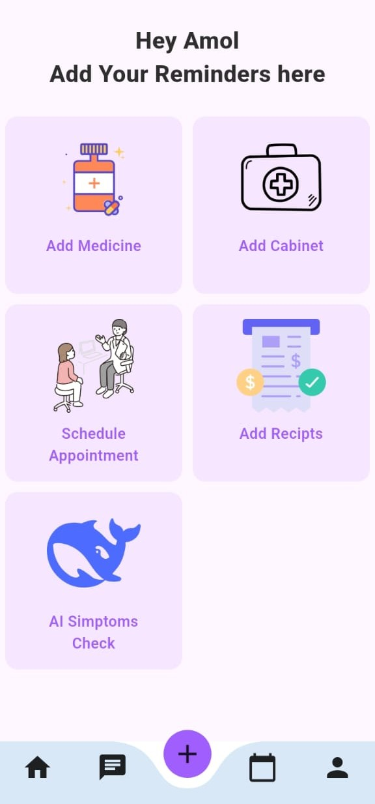 | 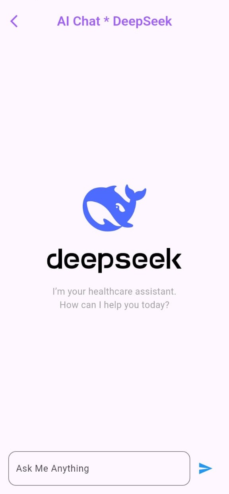 | 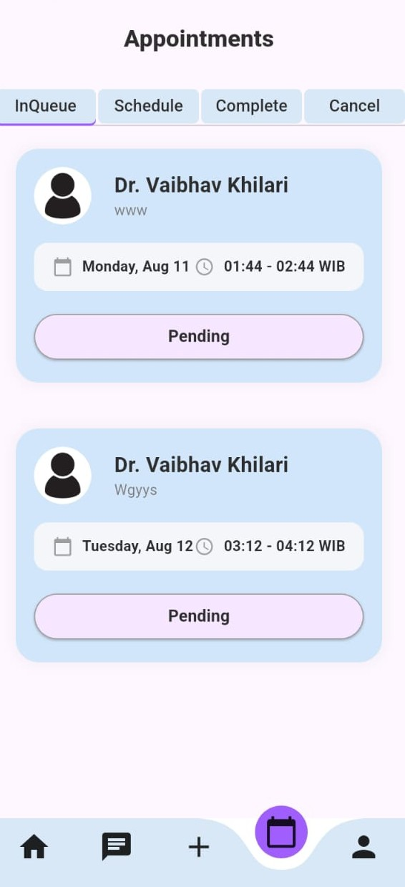 | 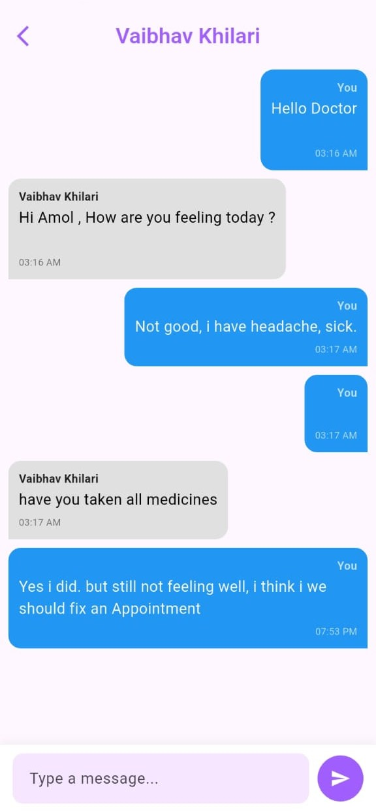 |

| Home (Patient) | Scheduled Appointments | Doctor List | Cabinet |
|----------------|------------------------|-------------|---------|
| 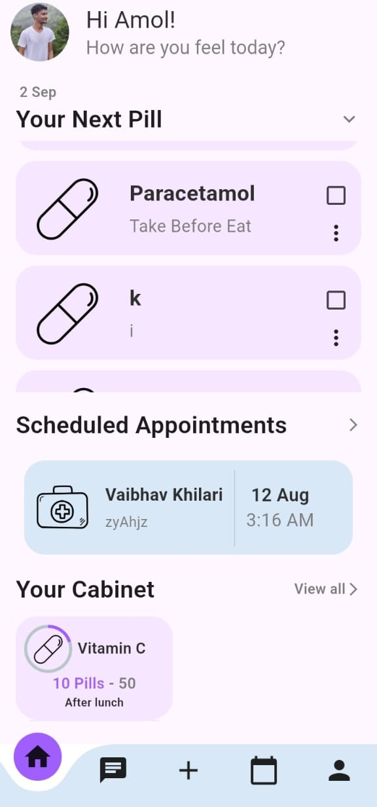 | 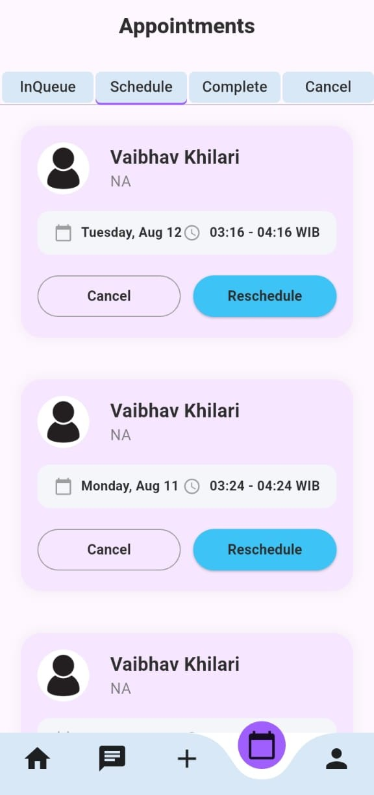 | 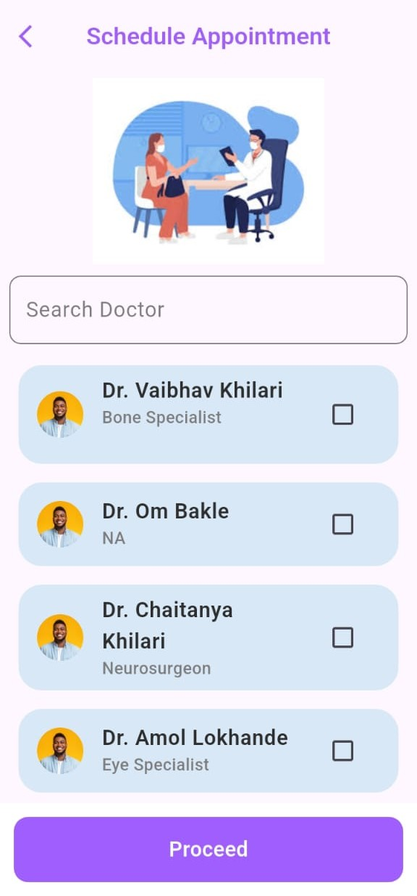 | 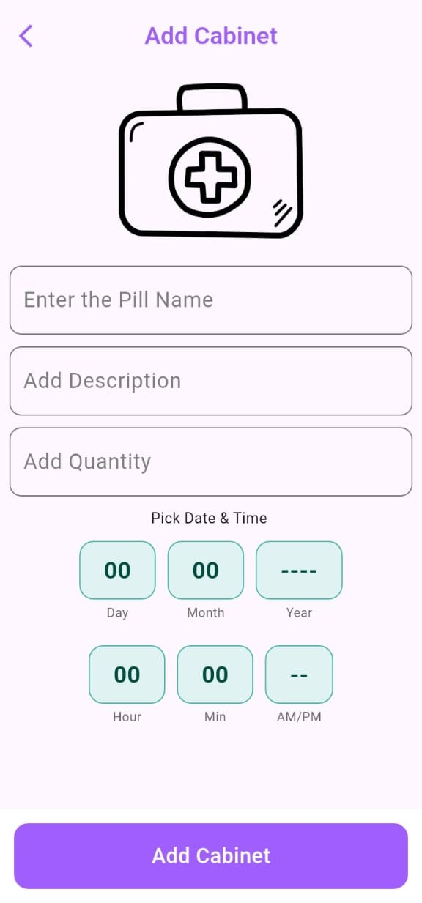 |

| Splash | Medicine | File Store | Profile (Patient) |
|--------|----------|------------|------------------|
| 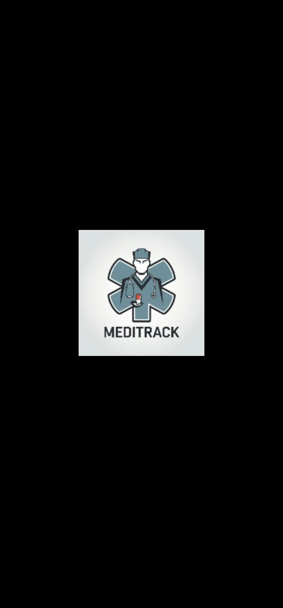 | 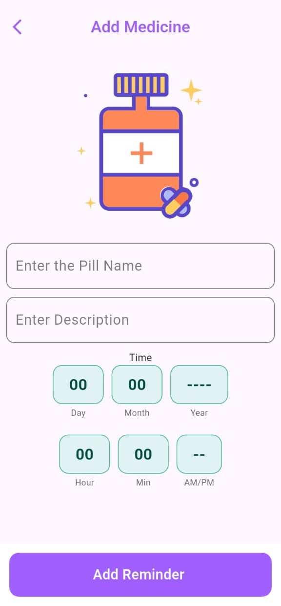 | 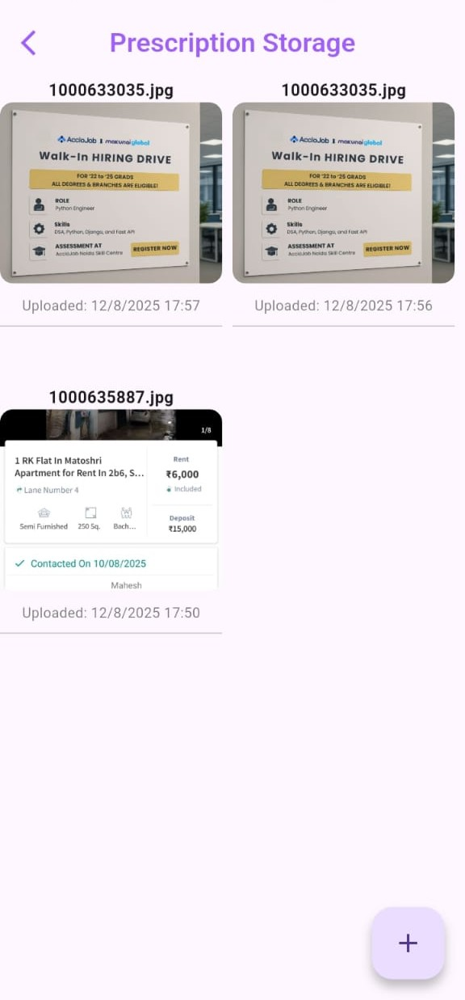 | 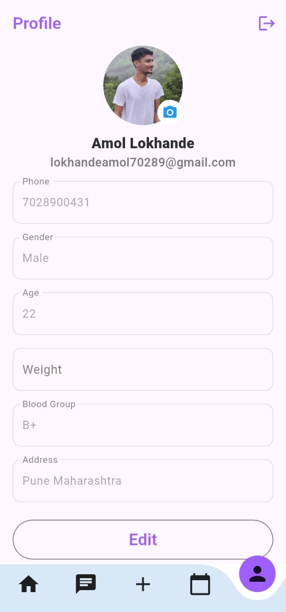 |


## 📸 Screenshots Patients
| Doctor Home | Docotor Chat | Doctor Profile | 
|-------------|---------|--------------|-------------|
| 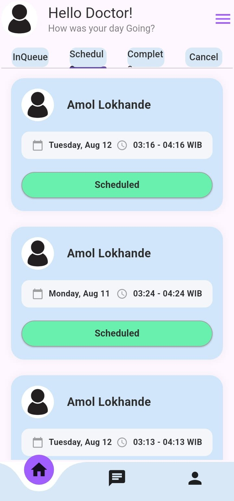 | 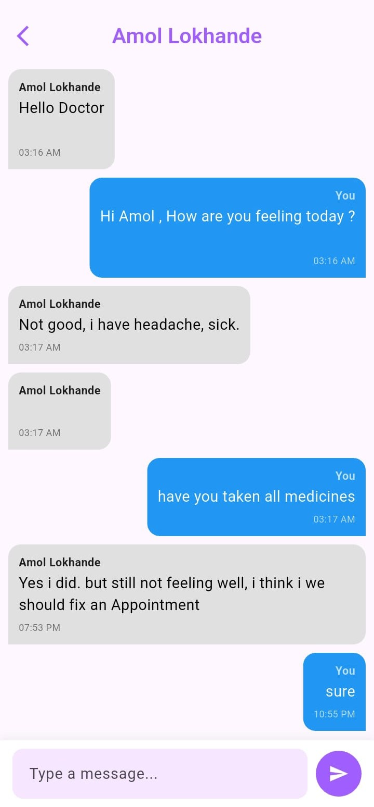 | 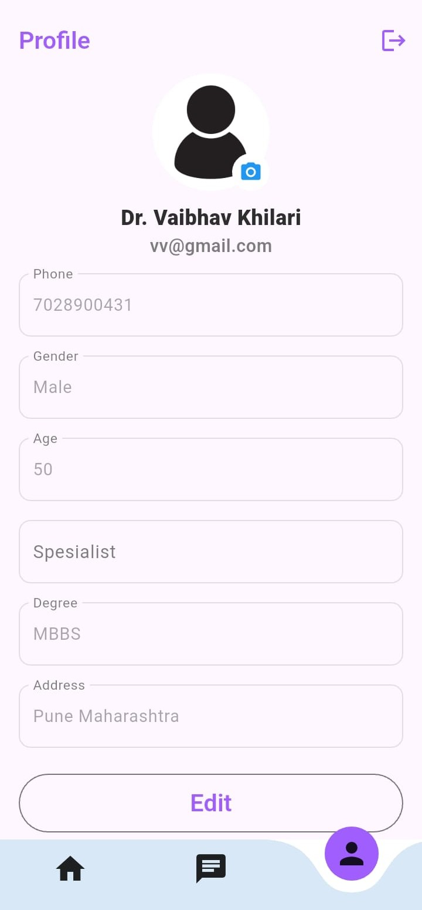 |
---

## 📂 Project Setup

1. Clone the repo  
   ```bash
   git clone https://github.com/yourusername/MediTrack.git
   cd MediTrack
